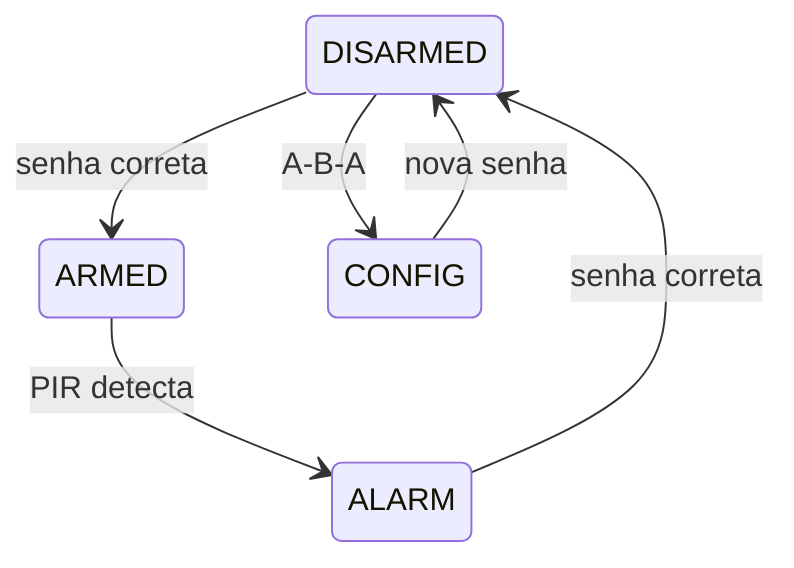

# Sistema de Alarme com Senha

## Características

- Microcontrolador: ATmega328P (Arduino UNO)
- Linguagem C AVR com registradores
- Sensor PIR DYP-ME003 (saída digital + interrupção INT0)
- Comunicação I2C com o Display LCD PCF8574 com controlador HD44780
- Teclado matricial 4×4
- Display LCD 16×2
- Buzzer ativo
- LEDs indicadores (armado/desarmado)
- Senha armazenada na EEPROM

## Pinagem

| Componente | Arduino | ATmega328P |
|---|---|---|
| LCD SDA | A4 | PC4 |
| LCD SCL | A5 | PC5 |
| PIR OUT | D2 | PD2 (INT0) |
| Buzzer | D3 | PD3 |
| Keypad Linhas (saída) | D4–D7 | PD4–PD7 |
| Keypad Colunas (entrada) | D8–D11 | PB0–PB3 |
| LED Armado | D12 | PB4 |
| LED Desarmado | D13 | PB5 |

### Pinagem do Teclado matricial 4×4 no Arduino

```
         C1(D8)  C2(D9)  C3(D10)  C4(D11)
L1(D4)   [1]     [2]     [3]      [A]
L2(D5)   [4]     [5]     [6]      [B]
L3(D6)   [7]     [8]     [9]      [C]
L4(D7)   [*]     [0]     [#]      [D]
```

## Senha

- Tamanho fixo: 6 dígitos (Também pode ser de tamanho variável. Pensar na implementação)
- Senha de fábrica: `123456` (Talvez pode ser colocada na memória Flash, já que será uma constante)
- Armazenada na EEPROM interna
- Alteração via sequência `A → B → A` no teclado

## Máquina de estados



## Plano de implementação

| Nº | Módulo | Descrição | Dependências | Com quem fica |
|---|---|---|---|---|
| 1 | `i2c.c / i2c.h` | Funções básicas do TWI: `i2c_setup()`, `i2c_start()`, `i2c_stop()`, `i2c_escrita()`, `i2c_leitura()` | Nenhuma | dev1 |
| 2 | `lcd.c / lcd.h` | Controle do LCD 16×2 via PCF8574: `lcd_setup()`, `lcd_limpar()`, `lcd_escrever()`, `lcd_ponteiro()` | `i2c` | dev1 |
| 3 | `teclado.c / teclado.h` | Varredura do teclado 4×4: `setup_teclado()`, `teclado_scan()`, com debounce por software | Nenhuma | dev2 |
| 4 | `eeprom.c / eeprom.h` | Leitura e gravação na EEPROM: `setar_senha()`, `ler_senha()`, `senha_existe()` | Nenhuma | dev2 |
| 5 | `pir.c / pir.h` | Detecção PIR com interrupção INT0: `setup_pir()`, `checar_pir()` | Nenhuma | main |
| 6 | `alarm.c / alarm.h` | Máquina de estados do alarme integrando todos os módulos anteriores | `lcd`, `keypad`, `pir`, `eeprom` |  main |
| 7 | `main.c` | Configuração geral, `setup_sistema()`, loop principal com polling dos eventos | `alarm` |  main |

### Teste (no main.c)

- **dev1**: testar se uma string aparece no display LCD após configurar a comunicação I2C.
- **dev2**:
  - **Teclado**: percorrer todas as 16 teclas e verificar se `teclado_scan()` retorna o valor esperado para cada uma; testar o debounce pressionando e soltando rapidamente.
  - **EEPROM**: gravar uma senha com `setar_senha()`, ler com `ler_senha()` e confirmar que os valores coincidem; testar `senha_existe()` antes e depois de alterar a senha. 

### Notas
- Talvez alarm.c possa ser implementado diretamente no main.c.
- lcd_ponteiro() serve para posicionar o cursor do display antes de escrever.
- teclado_scan() checa o teclado e retorna alguma tecla pressionada.
- setar_senha() serve para configurar uma nova senha.
- ler_senha() vai colocar a senha em um buffer para poder comparar com a senha digitada no teclado.
- senha_existe() é uma função auxiliar lógica para saber se uma senha diferente da de fábrica.
- setup_sistema() só junta todos os setups em uma função só. Pode ser excluído.

## Como executar o projeto a partir do projeto do Github

### Clonar
```bash
git clone https://github.com/murilo-rolo/Trabalho3MicMic
cd Trabalho3MicMic
git config merge.ours.driver true
```
O projeto está salvo como projeto do Microchip Studio, então execute esse comando na pasta de projeto padrão do Microchip Studio ou em uma pasta qualquer que você pretenda manter o projeto.
`git config merge.ours.driver true` serve para manter os arquivos `TrabalhoMicMic3.componentinfo.xml`, `TrabalhoMicMic3.cproj` e `main.c` com a versão local em merges.

### Como escolher sua branch

- **main** — branch de integração. Apenas o desenvolvedor responsável faz merge das branches dev1 e dev2 aqui, conforme cada módulo for concluído.
- **dev1 / dev2** — branches individuais. Cada desenvolvedor trabalha e commita na sua branch e faz push regularmente.

```bash
git branch
git checkout (nome da branch do desenvolvedor)
```
`git branch` serve só para listar as branches que existem no projeto.

Para manter sua branch atualizada com a main:
```bash
git checkout dev1
git pull origin main
```

### Commitar (guardar as alterações) e push (mandar para o GitHub)
```bash
git add .
git commit -m "(adicionar mensagem sobre o que alterou)"
git push origin (nome da branch que você é responsável)
```

Sugestão de formato para mensagens de commit: `tipo: descrição` — ex: `feat: driver i2c`, `fix: debounce keypad`.
